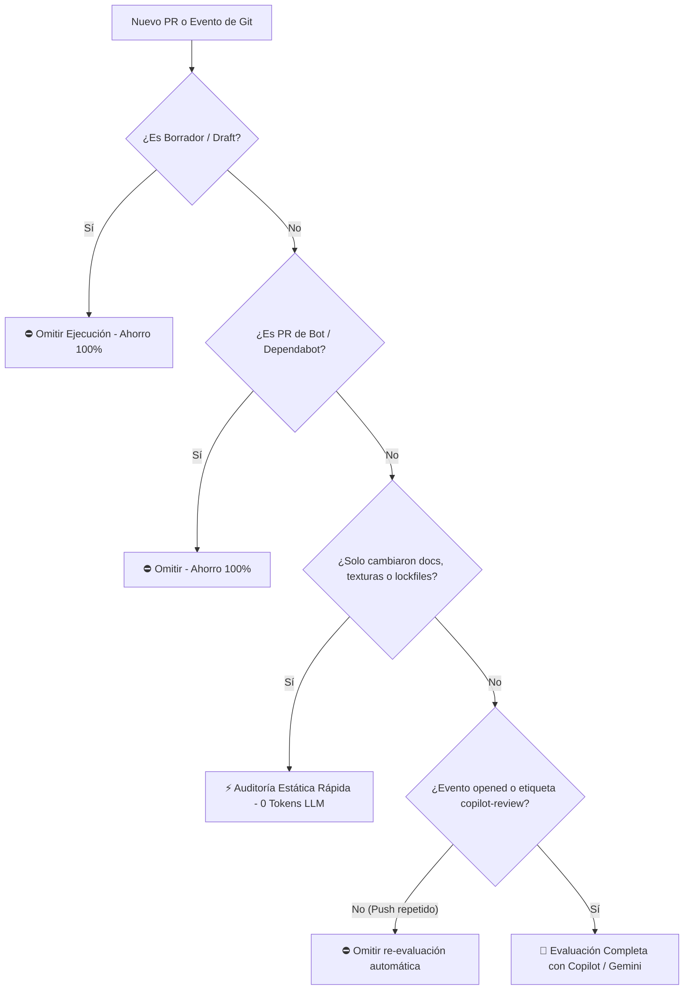

# 🤖 Gobernanza, Gestión y Revisión de PRs con GitHub Copilot

- **Estado:** `Activo / Configurado` 🟢
- **Mecanismos Clave:** `.github/copilot-instructions.md`, `.github/workflows/copilot-pr-governance.yml`, `.github/PULL_REQUEST_TEMPLATE.md`
- **Responsables:** Brayan Stid Cortés Lombana (`@brayancortes22`), July (`@july173`)
- **Relacionado:** [[00-Map-Of-Content]], [[03-Roles-y-Equipo]], [[04-Sprints-y-Roadmap]], [[15-Documentacion-Tecnica-Backend-Dotnet10]]

---

## 🎯 1. Propósito y Misión de GitHub Copilot en el Repositorio

Para garantizar que el flujo de trabajo del equipo mantenga la máxima velocidad sin descuidar los estándares de ingeniería de software, se ha delegado a **GitHub Copilot** la función de **Revisor y Gestor de Pull Requests (PRs)**.

Copilot actúa como un evaluador técnico implacable que audita cada propuesta de cambio contra el protocolo de trabajo obligatorio (**[[GEMINI.md]]**), liberando tiempo al equipo y emitiendo veredictos estructurados.

---

## 🛡️ 2. Reglas Innegociables Configuradas para Copilot

Las directrices oficiales residen en [`.github/copilot-instructions.md`](file:///c:/Users/NITRO%20ACER/Desktop/proyectos%20con%20ia/nasa%20project/.github/copilot-instructions.md) y se aplican a todas las revisiones automáticas:

1. **Modularidad Estricta (<150-200 líneas):** Ningún archivo nuevo o modificado puede convertirse en un God Object. Todo componente o servicio debe respetar el principio de responsabilidad única (SRP).
2. **Cero Código Quemado (No Hardcoding):** Prohibido el uso de IDs numéricos directos, URLs absolutas, strings mágicos repetidos o tasas fijas sin constantes tipadas, Enums (`TrendDirection`, `ObservationMode`) o variables de entorno.
3. **Estrategia Estricta de 3 Ramas:**
   - `development` ➔ Rama de integración diaria.
   - `qa` ➔ Staging de pruebas y calidad.
   - `production` ➔ Producción oficial de entrega.
   - **Regla:** Bloqueo absoluto de cualquier PR dirigido directamente a `production` que no provenga de `qa`.
4. **Blindaje Integral Anti-Bots:** Endpoints de mutación (`POST`, `PUT`, `DELETE`) deben incluir Honeypot invisible, Rate Limiting y validación perimetral de User-Agent.
5. **Rigor Científico No Paramétrico:** Test de Mann-Kendall con corrección de empates y Sen's Slope con intervalo al 95%.
6. **Documentación Viva:** Obligatoriedad de sincronizar `docs/obsidian/` en el mismo PR que modifica código.

---

## 🔋 3. Estrategia Anti-Saturación de Cuota Mensual

Para asegurar que el plan mensual de GitHub Copilot dure todo el ciclo sin agotamiento prematuro ni throttling, se implementó una arquitectura de **5 Filtros de Ahorro de Tokens**:



### Detalle de los Filtros:
1. **Filtro Drafts (`!draft`):** Copilot ignora PRs mientras se encuentren en estado de borrador.
2. **Filtro Anti-Bots:** Se ignoran automáticamente PRs generados por dependabot o bots de actualización de dependencias.
3. **Filtro de Extensiones y Assets:** Si el diff solo involucra `.md`, imágenes `.webp`, `.png`, modelos 3D `.glb` o `package-lock.json`, no se realiza ninguna llamada al modelo de IA, evitando consumo innecesario.
4. **Disparador One-Shot por Demanda:** Las evaluaciones se ejecutan al abrir el PR (`opened`), al pasar a listo para revisión (`ready_for_review`), o cuando un desarrollador añade explícitamente la etiqueta `copilot-review` o escribe el comando `/copilot-review` en un comentario. No se queman tokens en cada push intermedio.
5. **Diff Truncation Inteligente:** El diff enviado al análisis se circunscribe a un búfer controlado de código ejecutable relevante (`.cs`, `.ts`, `.tsx`, `.sql`, `.py`).

---

## 🔄 4. Mecanismo de Respaldo y Fallback (Smart AI Router)

En caso de que Copilot experimente límites de tasa temporales o la cuota alcance su tope al final del ciclo:
* El workflow conmuta automáticamente a **Auditoría Estática de Reglas** (`pr-audit-rules.mjs`), la cual verifica longitud de archivos, patrones sospechosos de código quemado y ciclo de vida de WebGL sin costo alguno.
* Para asistencia interactiva en el entorno de desarrollo, el desarrollador cuenta con la herramienta MCP local **`consult_free_ai` (Smart AI Router)**, la cual accede a modelos de inferencia gratuitos de alto rendimiento (Groq Qwen 3.8 27B / GPT-OSS 120B y OpenRouter Nemotron 3.5).

---

## 📋 5. Formato de Veredicto Emitido por Copilot

Cada revisión en el PR se publica con la siguiente estructura estandarizada:

```markdown
### 🤖 GitHub Copilot PR Review Assessment

#### 1. Verificación de Cumplimiento de Reglas
- [x] **Modularidad (<200 líneas):** PASA
- [x] **Cero Hardcoding (Enums/Env):** PASA
- [x] **Estrategia de Ramas:** PASA
- [x] **Seguridad / Anti-Bots:** PASA
- [x] **Rigor Científico (Mann-Kendall/Sen):** PASA
- [x] **Documentación en docs/obsidian/:** PASA

#### 2. Hallazgos y Sugerencias de Código
- Observación técnica o diff sugerido...

#### 3. Veredicto Final
**APROBADO ✅ / CAMBIOS SOLICITADOS ⚠️**
```

---

## 🚀 6. Guía Rápida para Desarrolladores

1. Crea tu rama de funcionalidad desde `development` (ej. `feat/mi-tarea`).
2. Implementa tu código respetando los límites de líneas (<200) y cero código quemado.
3. Actualiza la nota correspondiente en `docs/obsidian/`.
4. Abre el PR hacia `development` y llena la plantilla [`PULL_REQUEST_TEMPLATE.md`](file:///c:/Users/NITRO%20ACER/Desktop/proyectos%20con%20ia/nasa%20project/.github/PULL_REQUEST_TEMPLATE.md).
5. Si deseas una nueva revisión tras aplicar correcciones, añade un comentario con `/copilot-review` o la etiqueta `copilot-review`.
